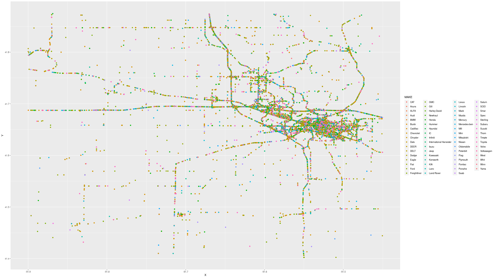
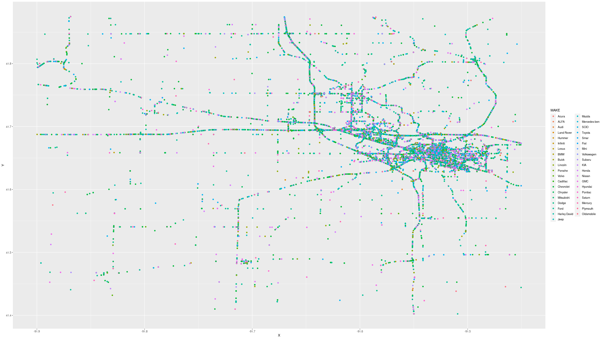
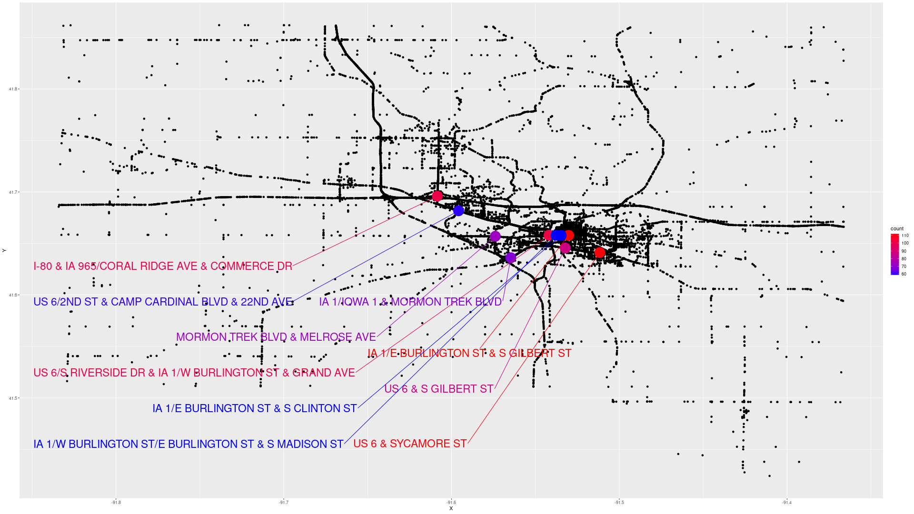
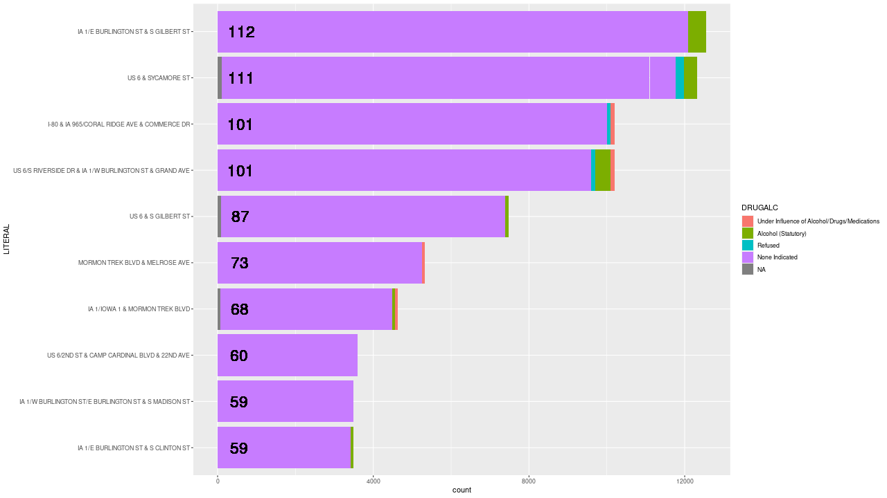

```{r setup, include=FALSE}
library(ggplot2)
library(ggrepel)
library(dplyr)
library(tidyr)
library(stringr)
library(lubridate)
library(RColorBrewer)
library(ggmap)
library(sf)
library(osmdata)

crash_data = read.csv('./ia_city_data.csv')
crash_vehicle_data = read.csv('./ia_city_vehicle_data.csv')
```

## Data Cleaning

```{r}
# Eliminate outliers
crash_data = crash_data %>% filter(X > -92 & Y < 42 & Y > 41.25)

# Update the vehicle data
crash_vehicle_data = crash_vehicle_data %>% filter(X > -91.9 & X < -91.45 & Y < 41.875 & Y > 41.4 & VEH_CRASH_KEY %in% unique(crash_data$CRASH_KEY))

# Fix datatypes
crash_data = crash_data %>% 
    mutate(CRASH_DATE = as_datetime(as.character(CRASH_DATE)),
        LECASENUM = as.numeric(LECASENUM),
        LITERAL = as.character(LITERAL),
        DRUGALC = factor(DRUGALC, levels=rev(c('None Indicated', 'Refused', 
            'Alcohol (<Statutory)', 'Drug/Alcohol (< Statutory)', 
            'Drug', 
            'Alcohol (Statutory)', 'Drug/Alcohol (Statutory)', 
            'Under Influence of Alcohol/Drugs/Medications')))) %>% 
    select(-X.1, -OBJECTID,
        -CITY_NUMBER, -DISTRICT, -COUNTY_NUMBER, -XCOORD, -YCOORD, 
        -CITY_NAME, -COUNTY_NAME, 
        -CRASH_DATETIME, -CRASH_DATETIME_UTC, -CRASH_DATETIME_UTC_OFFSET, -REST_UPDATED, -REST_UPDATE_UTC_OFFSET, 
        -CARDINAL, -GLOBALID)
        
crash_vehicle_data = crash_vehicle_data %>%
    mutate(CRASH_DATETIME = as_datetime(as.character(CRASH_DATETIME))) %>%
    select(-CRASH_DATETIME_UTC, CRASH_DATETIME_UTC_OFFSET, -REST_UPDATED, -REST_UPDATED_UTC_OFFSET, -GLOBALID)
    
# Fix dates
crash_data = crash_data %>% 
    separate(CRASH_DATE, c('year', 'month', 'day')) %>% select(-month) %>% mutate(year = as.numeric(year), day = as.numeric(day)) %>%
    separate(TIMESTR, c('hour', 'minute')) %>% mutate(hour = as.numeric(hour), minute = as.numeric(minute))
    
crash_vehicle_data = crash_vehicle_data %>% mutate(year = year(CRASH_DATETIME), month = month(CRASH_DATETIME), day = day(CRASH_DATETIME), 
    hour = hour(CRASH_DATETIME), minute = minute(CRASH_DATETIME)) %>% select(-CRASH_DATETIME)
    
# Fixing car make names

levels(crash_vehicle_data$MAKE)[levels(crash_vehicle_data$MAKE) == 'ACAT'] = 'CAT' 
    
levels(crash_vehicle_data$MAKE)[levels(crash_vehicle_data$MAKE) == 'Acur' | 
    levels(crash_vehicle_data$MAKE) == 'ACUR'] = 'Acura'
    
levels(crash_vehicle_data$MAKE)[levels(crash_vehicle_data$MAKE) == 'AUDI'] = 'Audi'

levels(crash_vehicle_data$MAKE)[levels(crash_vehicle_data$MAKE) == 'BIGD'] = 'BIG'

levels(crash_vehicle_data$MAKE)[levels(crash_vehicle_data$MAKE) == 'BLUE'] = 'Blue'

levels(crash_vehicle_data$MAKE)[levels(crash_vehicle_data$MAKE) == 'BUIC' | 
    levels(crash_vehicle_data$MAKE) == 'Buic'] = 'Buick'
    
levels(crash_vehicle_data$MAKE)[levels(crash_vehicle_data$MAKE) == 'Cadi' | 
    levels(crash_vehicle_data$MAKE) == 'Cagi' |
    levels(crash_vehicle_data$MAKE) == 'CADI'] = 'Cadillac'
    
levels(crash_vehicle_data$MAKE)[levels(crash_vehicle_data$MAKE) == 'CAPA'] = 'Capa'

levels(crash_vehicle_data$MAKE)[levels(crash_vehicle_data$MAKE) == 'Chev' | 
    levels(crash_vehicle_data$MAKE) == 'CHEV'] = 'Chevrolet'
    
levels(crash_vehicle_data$MAKE)[levels(crash_vehicle_data$MAKE) == 'Chry' | 
    levels(crash_vehicle_data$MAKE) == 'CHRY'] = 'Chrysler'
    
levels(crash_vehicle_data$MAKE)[levels(crash_vehicle_data$MAKE) == 'Dodg' | 
    levels(crash_vehicle_data$MAKE) == 'DODG' |
    levels(crash_vehicle_data$MAKE) == 'RAM' |
    levels(crash_vehicle_data$MAKE) == 'Ram'] = 'Dodge'
    
levels(crash_vehicle_data$MAKE)[levels(crash_vehicle_data$MAKE) == 'DUCA'] = 'Duca'

levels(crash_vehicle_data$MAKE)[levels(crash_vehicle_data$MAKE) == 'Eagl' | 
    levels(crash_vehicle_data$MAKE) == 'EGIL'] = 'Eagle'
    
levels(crash_vehicle_data$MAKE)[levels(crash_vehicle_data$MAKE) == 'ELDO'] = 'Eldo'

levels(crash_vehicle_data$MAKE)[levels(crash_vehicle_data$MAKE) == 'FIAT'] = 'Fiat'

levels(crash_vehicle_data$MAKE)[levels(crash_vehicle_data$MAKE) == 'FORD' |
    levels(crash_vehicle_data$MAKE) == 'FRD' |
    levels(crash_vehicle_data$MAKE) == 'VICT'] = 'Ford'

levels(crash_vehicle_data$MAKE)[levels(crash_vehicle_data$MAKE) == 'FRE' | 
    levels(crash_vehicle_data$MAKE) == 'Frei' | 
    levels(crash_vehicle_data$MAKE) == 'FREI' | 
    levels(crash_vehicle_data$MAKE) == 'FRET' | 
    levels(crash_vehicle_data$MAKE) == 'FRG' |
    levels(crash_vehicle_data$MAKE) == 'FRHG' | 
    levels(crash_vehicle_data$MAKE) == 'FRHT' | 
    levels(crash_vehicle_data$MAKE) == 'FRT' | 
    levels(crash_vehicle_data$MAKE) == 'FRTL' |
    levels(crash_vehicle_data$MAKE) == 'FTL'] = 'Freightliner'
    
levels(crash_vehicle_data$MAKE)[levels(crash_vehicle_data$MAKE) == 'GENU'] = 'Genu'

levels(crash_vehicle_data$MAKE)[levels(crash_vehicle_data$MAKE) == 'GEO'] = 'GMC'

levels(crash_vehicle_data$MAKE)[levels(crash_vehicle_data$MAKE) == 'GIL' | 
    levels(crash_vehicle_data$MAKE) == 'GILG' | 
    levels(crash_vehicle_data$MAKE) == 'GILL' | 
    levels(crash_vehicle_data$MAKE) == 'GLLG'] = 'Gill'
    
levels(crash_vehicle_data$MAKE)[levels(crash_vehicle_data$MAKE) == 'Harl' | 
    levels(crash_vehicle_data$MAKE) == 'HARL' |
    levels(crash_vehicle_data$MAKE) == 'HD' |
    levels(crash_vehicle_data$MAKE) == 'HDME' |
    levels(crash_vehicle_data$MAKE) == 'Harley Murra'] = 'Harley David'
    
levels(crash_vehicle_data$MAKE)[levels(crash_vehicle_data$MAKE) == 'HAUL' | 
    levels(crash_vehicle_data$MAKE) == 'NEWH' |
    levels(crash_vehicle_data$MAKE) == 'VNHL'] = 'Newhaul'
    
levels(crash_vehicle_data$MAKE)[levels(crash_vehicle_data$MAKE) == 'Hond' | 
    levels(crash_vehicle_data$MAKE) == 'HOND'] = 'Honda'
    
levels(crash_vehicle_data$MAKE)[levels(crash_vehicle_data$MAKE) == 'Humm' | 
    levels(crash_vehicle_data$MAKE) == 'HUMM' | 
    levels(crash_vehicle_data$MAKE) == 'HUMV'] = 'Hummer'
    
levels(crash_vehicle_data$MAKE)[levels(crash_vehicle_data$MAKE) == 'Hyun' | 
    levels(crash_vehicle_data$MAKE) == 'HYUN'] = 'Hyundai'
    
levels(crash_vehicle_data$MAKE)[levels(crash_vehicle_data$MAKE) == 'Ic' | 
    levels(crash_vehicle_data$MAKE) == 'IC' | 
    levels(crash_vehicle_data$MAKE) == 'IC B' | 
    levels(crash_vehicle_data$MAKE) == 'Ic C'] = 'IC'
    
levels(crash_vehicle_data$MAKE)[levels(crash_vehicle_data$MAKE) == 'Infi' | 
    levels(crash_vehicle_data$MAKE) == 'INFI'] = 'Infiniti'
    
levels(crash_vehicle_data$MAKE)[levels(crash_vehicle_data$MAKE) == 'INT' | 
    levels(crash_vehicle_data$MAKE) == 'Inte' | 
    levels(crash_vehicle_data$MAKE) == 'INTE' | 
    levels(crash_vehicle_data$MAKE) == 'Internationa' | 
    levels(crash_vehicle_data$MAKE) == 'INTL'] = 'International Harvester'
    
levels(crash_vehicle_data$MAKE)[levels(crash_vehicle_data$MAKE) == 'ISU' | 
    levels(crash_vehicle_data$MAKE) == 'Isuz' | 
    levels(crash_vehicle_data$MAKE) == 'ISUZ'] = 'Isuzu'
    
levels(crash_vehicle_data$MAKE)[levels(crash_vehicle_data$MAKE) == 'Jagu' | 
    levels(crash_vehicle_data$MAKE) == 'JAGU'] = 'Jaguar'
    
levels(crash_vehicle_data$MAKE)[levels(crash_vehicle_data$MAKE) == 'JEEP'] = 'Jeep'

levels(crash_vehicle_data$MAKE)[levels(crash_vehicle_data$MAKE) == 'Kawa' | 
    levels(crash_vehicle_data$MAKE) == 'KAWK'] = 'Kawasaki'
    
levels(crash_vehicle_data$MAKE)[levels(crash_vehicle_data$MAKE) == 'KEN' | 
    levels(crash_vehicle_data$MAKE) == 'KENT' | 
    levels(crash_vehicle_data$MAKE) == 'Kenw' | 
    levels(crash_vehicle_data$MAKE) == 'KENW' |
    levels(crash_vehicle_data$MAKE) == 'KW'] = 'Kenworth'
    
levels(crash_vehicle_data$MAKE)[levels(crash_vehicle_data$MAKE) == 'LANC' |
    levels(crash_vehicle_data$MAKE) == 'LC'] = 'Lanc'

levels(crash_vehicle_data$MAKE)[levels(crash_vehicle_data$MAKE) == 'LAND' |
    levels(crash_vehicle_data$MAKE) == 'Land' |
    levels(crash_vehicle_data$MAKE) == 'LNDR'] = 'Land Rover'
    
levels(crash_vehicle_data$MAKE)[levels(crash_vehicle_data$MAKE) == 'LEXS' | 
    levels(crash_vehicle_data$MAKE) == 'Lexu' | 
    levels(crash_vehicle_data$MAKE) == 'LEXU'] = 'Lexus'
    
levels(crash_vehicle_data$MAKE)[levels(crash_vehicle_data$MAKE) == 'LINC' |
    levels(crash_vehicle_data$MAKE) == 'Linc'] = 'Lincoln'
    
levels(crash_vehicle_data$MAKE)[levels(crash_vehicle_data$MAKE) == 'MACK'] = 'Mack'

levels(crash_vehicle_data$MAKE)[levels(crash_vehicle_data$MAKE) == 'Mazd' |
    levels(crash_vehicle_data$MAKE) == 'MAZD'] = 'Lincoln'
    
levels(crash_vehicle_data$MAKE)[levels(crash_vehicle_data$MAKE) == 'MINI' |
    levels(crash_vehicle_data$MAKE) == 'MNNI'] = 'Mini'

levels(crash_vehicle_data$MAKE)[levels(crash_vehicle_data$MAKE) == 'MILL'] = 'Mill'

# this is ambiguous between mercury and mercedes benz
levels(crash_vehicle_data$MAKE)[levels(crash_vehicle_data$MAKE) == 'Merc' |
    levels(crash_vehicle_data$MAKE) == 'MERC'] = 'Mercury'
    
levels(crash_vehicle_data$MAKE)[levels(crash_vehicle_data$MAKE) == 'MERZ'] = 'Mercedes-ben'

levels(crash_vehicle_data$MAKE)[levels(crash_vehicle_data$MAKE) == 'MITS' |
    levels(crash_vehicle_data$MAKE) == 'Mits'] = 'Mitsubishi'
    
levels(crash_vehicle_data$MAKE)[levels(crash_vehicle_data$MAKE) == 'MON'] = 'MONS'

levels(crash_vehicle_data$MAKE)[levels(crash_vehicle_data$MAKE) == 'N/A' |
    levels(crash_vehicle_data$MAKE) == 'NR' |
    levels(crash_vehicle_data$MAKE) == 'UNKNO' |
    levels(crash_vehicle_data$MAKE) == 'UNK' |
    levels(crash_vehicle_data$MAKE) == 'Unkn' |
    levels(crash_vehicle_data$MAKE) == 'UNKN' |
    levels(crash_vehicle_data$MAKE) == 'UKNO' |
    levels(crash_vehicle_data$MAKE) == 'VAN' |
    levels(crash_vehicle_data$MAKE) == 'Util' |
    levels(crash_vehicle_data$MAKE) == 'UTIM' |
    levels(crash_vehicle_data$MAKE) == 'VANG'] = NA

levels(crash_vehicle_data$MAKE)[levels(crash_vehicle_data$MAKE) == 'NISS' |
    levels(crash_vehicle_data$MAKE) == 'Niss'] = 'Nissan'
    
levels(crash_vehicle_data$MAKE)[levels(crash_vehicle_data$MAKE) == 'OLDS' |
    levels(crash_vehicle_data$MAKE) == 'Olds'] = 'Oldsmobile'
    
levels(crash_vehicle_data$MAKE)[levels(crash_vehicle_data$MAKE) == 'OPTI' |
    levels(crash_vehicle_data$MAKE) == 'OPT'] = 'Opti'
    
levels(crash_vehicle_data$MAKE)[levels(crash_vehicle_data$MAKE) == 'PETE' |
    levels(crash_vehicle_data$MAKE) == 'Pete' |
    levels(crash_vehicle_data$MAKE) == 'PTRB'] = 'Peterbilt'
    
levels(crash_vehicle_data$MAKE)[levels(crash_vehicle_data$MAKE) == 'PLYM' |
    levels(crash_vehicle_data$MAKE) == 'Plym'] = 'Plymouth'
    
levels(crash_vehicle_data$MAKE)[levels(crash_vehicle_data$MAKE) == 'PONT' |
    levels(crash_vehicle_data$MAKE) == 'Pont'] = 'Pontiac'
    
levels(crash_vehicle_data$MAKE)[levels(crash_vehicle_data$MAKE) == 'PORS' |
    levels(crash_vehicle_data$MAKE) == 'Pors' |
    levels(crash_vehicle_data$MAKE) == 'PRO'] = 'Porsche'
    
levels(crash_vehicle_data$MAKE)[levels(crash_vehicle_data$MAKE) == 'SAA'] = 'Saab'

levels(crash_vehicle_data$MAKE)[levels(crash_vehicle_data$MAKE) == 'SATR' |
    levels(crash_vehicle_data$MAKE) == 'Satu' |
    levels(crash_vehicle_data$MAKE) == 'SATU' |
    levels(crash_vehicle_data$MAKE) == 'STRN'] = 'Saturn'
    
levels(crash_vehicle_data$MAKE)[levels(crash_vehicle_data$MAKE) == 'SMRT'] = 'Smar'

levels(crash_vehicle_data$MAKE)[levels(crash_vehicle_data$MAKE) == 'STER' | 
    levels(crash_vehicle_data$MAKE) == 'Ster' | 
    levels(crash_vehicle_data$MAKE) == 'STLG' | 
    levels(crash_vehicle_data$MAKE) == 'STRG'] = 'Sterling'
    
levels(crash_vehicle_data$MAKE)[levels(crash_vehicle_data$MAKE) == 'Suba' |
    levels(crash_vehicle_data$MAKE) == 'SUBA'] = 'Subaru'
    
levels(crash_vehicle_data$MAKE)[levels(crash_vehicle_data$MAKE) == 'SUPR'] = 'Supr'

levels(crash_vehicle_data$MAKE)[levels(crash_vehicle_data$MAKE) == 'SUZI' |
    levels(crash_vehicle_data$MAKE) == 'Suzu' |
    levels(crash_vehicle_data$MAKE) == 'SUZU'] = 'Suzuki'

levels(crash_vehicle_data$MAKE)[levels(crash_vehicle_data$MAKE) == 'SYM'] = 'SYMG'

levels(crash_vehicle_data$MAKE)[levels(crash_vehicle_data$MAKE) == 'THMS' |
    levels(crash_vehicle_data$MAKE) == 'THOM'] = 'Thom'
    
levels(crash_vehicle_data$MAKE)[levels(crash_vehicle_data$MAKE) == 'Toyo' |
    levels(crash_vehicle_data$MAKE) == 'TOYO' |
    levels(crash_vehicle_data$MAKE) == 'TOYT'] = 'Toyota'
    
levels(crash_vehicle_data$MAKE)[levels(crash_vehicle_data$MAKE) == 'VESP'] = 'Vesp'

levels(crash_vehicle_data$MAKE)[levels(crash_vehicle_data$MAKE) == 'VOLV' | 
    levels(crash_vehicle_data$MAKE) == 'VOLO' | 
    levels(crash_vehicle_data$MAKE) == 'VOLV' | 
    levels(crash_vehicle_data$MAKE) == 'Volv' |
    levels(crash_vehicle_data$MAKE) == 'VLV'] = 'Volvo'
    
levels(crash_vehicle_data$MAKE)[levels(crash_vehicle_data$MAKE) == 'Volk' |
    levels(crash_vehicle_data$MAKE) == 'VOLK' |
    levels(crash_vehicle_data$MAKE) == 'VOL'] = 'Volkswagen'
    
levels(crash_vehicle_data$MAKE)[levels(crash_vehicle_data$MAKE) == 'WEST'] = 'West'

levels(crash_vehicle_data$MAKE)[levels(crash_vehicle_data$MAKE) == 'WHIT'] = 'Whit'

levels(crash_vehicle_data$MAKE)[levels(crash_vehicle_data$MAKE) == 'WINN'] = 'Winn'

levels(crash_vehicle_data$MAKE)[levels(crash_vehicle_data$MAKE) == 'WRKH' |
    levels(crash_vehicle_data$MAKE) == 'WORK'] = 'Work'
    
levels(crash_vehicle_data$MAKE)[levels(crash_vehicle_data$MAKE) == 'YAMA'] = 'Yama'

levels(crash_vehicle_data$MAKE)[levels(crash_vehicle_data$MAKE) == 'TRIU'] = 'Triu'

valid_makes = c('CAT', 'Acura', 'ALFA', 'Audi', 
    'BMW', 'Buick', 
    'Cadillac', 'Chevrolet', 'Chrysler',
    'Dats', 'DEER', 'DELT', 'Dodge',
    'Eagle',
    'Fiat', 'Ford', 'Freightliner',
    'GMC', 'Gill', 
    'Harley David', 'Honda', 'Hummer', 'Hyundai',
    'IC', 'Infiniti', 'International Harvester', 'Isuzu',
    'Jaquar', 'Jeep',
    'Kawasaki', 'Kenworth', 'KIA', 
    'Lanc', 'Land Rover', 'Lexus', 'Lincoln', 
    'Mack', 'Mazda', 'Mercury', 'Mercedes-ben', 'Mini', 'Mill', 'Mitsubishi',
    'Newhaul', 'Nissan',
    'Oldsmobile', 
    'Peterbilt', 'Piag', 'Plymouth', 'Pontiac', 'Porsche',
    'Saab', 'Saturn', 'SCIO', 'Smar', 'Spec', 'Sterling', 'Subaru', 'Suzuki',
    'Thom', 'Timpte', 'Toyota', 
    'Volkswagen', 'Volvo',
    'West', 'Whit', 'Winn',
    'Yama')
    
levels(crash_vehicle_data$MAKE)[!levels(crash_vehicle_data$MAKE) %in% valid_makes] = NA
    
    
print(levels(crash_vehicle_data$MAKE))
```

## Data Exploration

```{r}
crash_data = crash_data[order(crash_data$CASENUMBER),]
crash_vehicle_data = crash_vehicle_data[order(crash_vehicle_data$CASENUMBER),]

str(crash_data)
str(crash_vehicle_data)

# Lets look at some time data
crdt = crash_data %>% group_by(year)
crdt %>% ggplot(aes(x=X, y=Y, color=year)) + geom_point()
```

From this you can see that there are less accidents taking place outside of the city over time, and many more recent accidents from within the city. Except for on highways and major roadways.

```{r}
levels(crdt$DRUGALC)
counts = crdt %>% summarize(counts = n())
master = left_join(crdt, counts, by='year') 
master %>% ggplot(aes(x=year, y=counts, fill=DRUGALC)) + geom_bar(stat='identity') + scale_fill_brewer(palette = 'RdYlBu')
film = master %>% filter(DRUGALC != 'None Indicated')
film %>% ggplot(aes(x=year, y=counts, fill=DRUGALC)) + geom_bar(stat='identity') + scale_fill_brewer(palette = 'RdYlBu')
```

It would appear that the number of accidents that occur due to drunk driving, or the influence of drugs, is very little in comparison to the amount that don't have any influence at all, but there appears to be an increase in drug use as we move forward to closer years, this is likely due to the wide adoption of narcotics in other states. Though, we've also seen a steady decline in drug use as time goes on.

You can also see that out of all cases, the vast majority of offenses stem from being over the limit for alcohol content.

And it would seem that the DOT may have been doing away with having separate types of classifications for drugs/alcohol, so we should merge those levels together to get an accurate result.

```{r}
levels(film$DRUGALC)[levels(film$DRUGALC) == 'Drug/Alcohol (Statutory)' | levels(film$DRUGALC) == 'Drug' | levels(film$DRUGALC) == 'Drug/Alcohol (< Statutory)'] = 'Under Influence of Alcohol/Drugs/Medications'
# levels(film$DRUGALC) = c('Under Influence of Alcohol/Drugs/Medications', 'Alcohol (Statutory)', 'Refused', 'None Indicated')

tcounts = film %>% group_by(year, DRUGALC) %>% summarize(tcount=n())
film = left_join(film, tcounts, by=c('year', 'DRUGALC')) %>% mutate(tperc = tcount/counts*100)

film %>% ggplot(aes(x=year, y=counts, fill=DRUGALC)) + geom_bar(stat='identity') + scale_fill_brewer(palette = 'RdYlBu')
film %>% ggplot(aes(x=DRUGALC, y=tcount, fill=DRUGALC, label=round(tperc, digits=3))) + 
    facet_wrap(~year) + 
    geom_bar(stat='identity', position='dodge') + scale_fill_brewer(palette='RdYlBu') + 
    geom_text(aes(y=tcount / 2), nudge_y=20, color='black', srt=90, size=3) +
    theme(axis.text.y = element_blank(), axis.text.x = element_blank(), axis.ticks = element_blank()) + 
    labs(y='Incident count (%)', title='Drug/Alcohol distribution by year')

levels(crash_data$DRUGALC)[levels(crash_data$DRUGALC) == 'Drug/Alcohol (Statutory)' | levels(crash_data$DRUGALC) == 'Drug' | levels(crash_data$DRUGALC) == 'Drug/Alcohol (< Statutory)'] = 'Under Influence of Alcohol/Drugs/Medications'
```

## Visual Chloropleth Map

### Distribution of drug/alcohol usage

```{r}
crash_data_f = crash_data %>% filter(DRUGALC != 'None Indicated')
crash_data_f %>% ggplot(aes(x=X, y=Y, color=DRUGALC)) + geom_point() + scale_color_brewer(palette='Dark2')
```

This shows that there really isn't a specific bias towards drug/alcohol usage with respect to location, it's pretty evenly distributed. Though, it can be seen that more people refuse tests on the Highway (up/down)

### Distribution of car make usage

```{r}
png('./county_vehicle_plot.png', width = 1920, height = 1080)
crash_vehicle_data %>% filter(!is.na(MAKE)) %>% ggplot(aes(x=X, y=Y, color=MAKE)) + geom_point() # + scale_color_brewer(palette='Dark2')
dev.off()
```


This is an interesting plot, because it shows the distribution of types of cars around the county, towards the inside of the city you start to see a lot more GMC, Saturn, Suburu, Buick, whilst out in the country, you see a lot of Cadillac, Chevy, Ford, which makes sense, but one question I have is, can you tell where the poor district is juding by the price point of specific cars?

To do this, I'll rearrange the general price range of each Make, along with any stereotypical use (trucking), and then look at the map again.

```{r}
valid_makes = c('CAT', 'Acura', 'ALFA', 'Audi', 
    'BMW', 'Buick', 
    'Cadillac', 'Chevrolet', 'Chrysler',
    'Dats', 'DEER', 'DELT', 'Dodge',
    'Eagle',
    'Fiat', 'Ford', 'Freightliner',
    'GMC', 'Gill', 
    'Harley David', 'Honda', 'Hummer', 'Hyundai',
    'IC', 'Infiniti', 'International Harvester', 'Isuzu',
    'Jaquar', 'Jeep',
    'Kawasaki', 'Kenworth', 'KIA', 
    'Lanc', 'Land Rover', 'Lexus', 'Lincoln', 
    'Mack', 'Mazda', 'Mercury', 'Mercedes-ben', 'Mini', 'Mill', 'Mitsubishi',
    'Newhaul', 'Nissan',
    'Oldsmobile', 
    'Peterbilt', 'Piag', 'Plymouth', 'Pontiac', 'Porsche',
    'Saab', 'Saturn', 'SCIO', 'Smar', 'Spec', 'Sterling', 'Subaru', 'Suzuki',
    'Thom', 'Timpte', 'Toyota', 
    'Volkswagen', 'Volvo',
    'West', 'Whit', 'Winn',
    'Yama')
    
valid_makes = c('Acura', 'ALFA', 'Audi', 'Land Rover', 'Hummer', 'Infiniti', 'Lexus',
    'BMW', 'Buick', 'Jaguar', 'Lincoln', 'Porsche', 'Volvo',
    'Cadillac', 'Chevrolet', 'Chrysler', 'Mitsubishi',
    'Dodge', 'Ford', 'Harley David', 'Jeep', 'Mazda', 'Mercedes-ben', 'SCIO', 'Toyota',
    'Smar', 'Fiat', 'Mini', 'Volkswagen', 'Subaru', 'KIA', 'Honda', 'Nissan',
    'GMC', 'Hyundai', 'Pontiac', 'Saturn', 'Mercury', 'Plymouth',
    'Oldsmobile')
    
levels(crash_vehicle_data$MAKE)[!levels(crash_vehicle_data$MAKE) %in% valid_makes] = NA
crash_vehicle_data$MAKE = factor(crash_vehicle_data$MAKE, levels=valid_makes)
png('./county_vehicle_plot_redlining.png', width = 1920, height = 1080)
crash_vehicle_data %>% filter(!is.na(MAKE)) %>% ggplot(aes(x=X, y=Y, color=MAKE)) + geom_point() # + scale_color_brewer(palette='Dark2')
dev.off()
```


You can see from this that there is a distribution of cheap cars along major roadways and in the inner cities, whilst there are richer cars out in the country.

### Most Dangerous Intersections

```{r}
streets = crash_data %>% mutate(total=X*X+Y*Y) 

scnt = streets %>% 
    group_by(total) %>% 
    summarize(count = n())
    
streets = streets %>% 
    left_join(scnt, by='total') %>% 
    arrange(desc(count))

str(streets %>% distinct(LITERAL, .keep_all=TRUE))
head(unique(streets$LITERAL), 10)

topstreets_ic = streets %>% 
    distinct(total, .keep_all=TRUE) %>% 
    distinct(LITERAL, .keep_all=TRUE) %>% 
    filter(LITERAL %in% head(LITERAL, 10))

# X > -91.9 & X < -91.45 & Y < 41.875 & Y > 41.4
iac_city_map <- get_map(left=-91.9, bottom=41.8, right=-91.3, top=42.3)

iac <- get_map(getbb("Iowa City"))

topstreets_ic <- topstreets %>% 
    mutate(LITERAL = as.character(LITERAL),
        LITERAL = case_when(
        str_detect(LITERAL, "ST & S GILBERT") ~ "BURLINGTON & GILBERT",
        str_detect(LITERAL, "SYCAMORE") ~ "US6 & SYCAMORE",
        str_detect(LITERAL, "RIVERSIDE") ~ "RIVERSIDE & BURLINGTON",
        str_detect(LITERAL, "I-80 & IA") ~ "I80 & CORAL RIDGE AVE",
        str_detect(LITERAL, "US 6 & S GILBERT") ~ "US6 & GILBERT",
        str_detect(LITERAL, "& MORMON") ~ "MORMON TREK & MELROSE",
        str_detect(LITERAL, "IA 1/IOWA") ~ "IA1 & MORMON TREK",
        str_detect(LITERAL, "US6/2ND") ~ "US6 & CAMP CARDINAL BLVD",
        str_detect(LITERAL, "IA 1/E BURL") ~ "BURLINGTON & CLINTON",
        str_detect(LITERAL, "IA 1/W BURL") ~ "BURLINGTON & MADISON",
        TRUE ~ LITERAL))

png('./iac_intersection.png', width = 1920, height = 1080)
ggmap(iac) +
    geom_point(data=topstreets_ic, aes(x=X, y=Y, color=count), size=5) + 
    geom_label_repel(data=topstreets_ic, aes(x=X, y=Y, label=LITERAL),
                     box.padding = 0.35,
                     point.padding = 0.5,
                     segment.colour = 'black') +
    scale_color_gradient(low='blue', high='red')
dev.off()

```


Here is an image of the top 10 most frequently accidented intersections in Johnson County

#### Breakdown of types of accidents at the most frequented intersections

```{r}
png('./county_street_dist.png', width = 1280, height = 720)
streets %>% filter(LITERAL %in% topstreets$LITERAL & count >= 50) %>% mutate(LITERAL = factor(LITERAL, levels=rev(unique(LITERAL)))) %>%
    ggplot(aes(x=LITERAL, y=count, label=count, fill=DRUGALC)) + 
        geom_bar(stat='identity') + 
        scale_color_brewer(palette='Dark2') + coord_flip() +
        geom_text(size=8, nudge_y=500)
dev.off()
```

